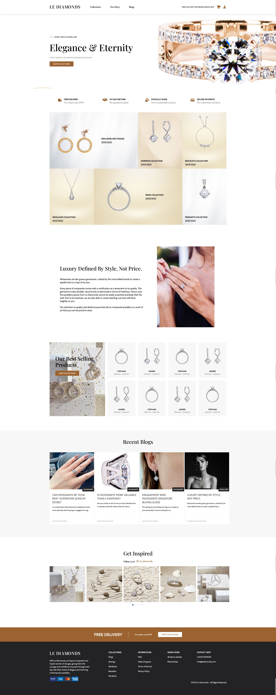
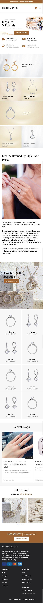

# Le Diamonds

This is my clone of the Le Diamonds website, through which the design was provided by way of a Figma design file.

## Table of contents

- [Summary](#summary)
- [Built with](#built-with)
- [Challenges](#challenges)
- [Screenshots](#screenshots)

## Summary

The challenge was to clone a landing page for a jewellery e-store named Le Diamonds. My approach was to break down each major part of the page into separate sections, plus a header and footer, and work on the markup and styling of each one, before cycling back to make adjustments where appropriate.

I added some chunks of functionality that were not explicitly specified in the design document:

- Expandable navigation menu on small viewports (using Javascript)
- Hover effects for buttons and links
- Styled focus outlines for buttons and links, for accessibility purposes
- The blog and Instagram feed sections are able to scroll horizontally, by use of the `overflow` attribute

In terms of other differences from the design document, minor adjustments were made to attributes such as margin and padding, where rounding up/down was done when the design document specified a number with decimals.

I also used a variation of the Bodoni font, Bodoni Moda, which was available on [Google Fonts](https://fonts.google.com/specimen/Bodoni+Moda?query=bodoni+moda), due to Bodoni 72 not being available for free usage.

## Built with

This landing page was built with HTML, Sass (SCSS) and Javascript. I used SCSS instead of vanilla CSS due to its modularisation capabilities, which greatly streamlined my development process.

## Challenges

I initially encountered a few obstacles with having some images resize within their containers, even though `max-width: 100%` had already been declared in the CSS reset.

A challenge that I aim to complete in continued development of this page is being able to add functionality to the Instagram photo feed section of the page, where a dot would be active when the corresponding image enters the middle of the viewport. This would be particularly convenient when browsing on smaller screens such as mobile devices.

## Screenshots

Desktop

Mobile

